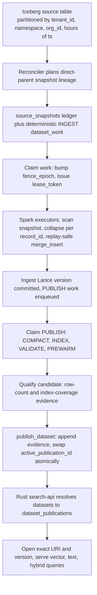

# ETL data flow: how one record travels end to end

This document follows a single record from the Iceberg source table, through the local reconciler
and Spark, into a published Lance dataset, and finally out through the Rust search service. It is
written for an engineer who is new to the codebase and wants the whole path in one narrative. It
describes the system as the code actually behaves today, so where an older document still mentions
a `dataset_state`, `dataset_specs`, or `reconciler_settings` table, this document reflects the
current, simpler shape instead.

Two identifiers appear throughout. The unique row key of the whole system is `record_id`. The one
record timestamp is `ts`. There is no second time column and no per-row expiry value.

For the decisions behind each stage, see the architecture decision records under
[docs/adr/](adr/README.md). This document links the relevant ones by path rather than restating
them.

## The shape of the system

`lance-etl` keeps per-route Lance datasets synchronized with one registered Iceberg table. It runs
as local processes on one machine. PostgreSQL is the only durable control plane. Spark is an
execution dependency that the reconciler creates and stops. The Rust search service is optional and
serves exact published Lance versions.

The logical dataset key is the trio `(tenant_id, namespace, org_id)`. There is exactly one Lance
dataset and one active publication per key, and every search is scoped to one key. Cross-org and
shared-dataset designs are rejected by construction (see
[docs/adr/etl-and-data-model.md](adr/etl-and-data-model.md), ADR 0004).

The control plane is normalized into exactly nine application tables
([docs/adr/postgresql-dataset-control-plane.md](adr/postgresql-dataset-control-plane.md), ADR 0042):

| Table | Role |
|---|---|
| `dataset_spec_revisions` | Immutable, numbered data contract carrying its own `spec_id`, `name`, and `description` |
| `dataset_fields` | Ordered target schema and its projection from Iceberg |
| `index_definitions` | Required Lance indexes with typed IVF_RQ and INVERTED options as nullable columns |
| `iceberg_sources` | The registered source table, its immutable UUID, storage root, and planning fence |
| `source_snapshots` | The exact Iceberg snapshot ledger and blocked-history evidence |
| `datasets` | First-class route identity plus the mutable materialization cursor, `fence_epoch`, and `active_publication_id` |
| `dataset_work` | Deterministic work rows with lease, attempt count, phase, and latest error |
| `dataset_publications` | Immutable serving evidence for one exact Lance version |
| `publication_indexes` | Per-index coverage evidence for one publication |

Note that the physical materialization cursor lives directly on the `datasets` row. The columns
`materialized_spec_revision_id`, `last_applied_source_snapshot_seq`, `ingest_lance_uri`,
`ingest_lance_version`, `active_publication_id`, and `fence_epoch` are all fields of `datasets`.
Loop policy is process bootstrap configuration read from the environment, not a database table.

## The happy path at a glance



Each stage is described in detail below.

## Stage 1: the Iceberg source table and the snapshot ledger

The source is one partitioned Iceberg table. Every record carries the routing trio, a unique
`record_id`, an operation column (`op`), a single timestamp `ts`, and the three maps `vectors`,
`texts`, and `metadata`. The Iceberg partition contract is
`(tenant_id, namespace, org_id, hours(ts))`. That contract is validated on every planning run by
`validate_partition_contract` in `source/contract.py`, whose `REQUIRED_PARTITION_FIELDS` fixes the
partition field names and the last partition to `hour(ts)`. Baseline qualification and ingestion
enforce the complete physical schema. Source column aliases are not configuration. A table with
different physical names must be rewritten to this canonical contract.

The reconciler never trusts wall-clock time or numeric snapshot ordering to decide source progress.
It follows the exact direct-parent snapshot chain instead
([docs/adr/etl-and-data-model.md](adr/etl-and-data-model.md), ADR 0003). `walk_snapshot_lineage`
in `source/lineage.py` walks from the pinned head down through each `parent_snapshot_id` to the last
recorded ancestor, rejecting cycles, forks, missing links, and any chain whose Iceberg sequence
numbers do not strictly increase. The Spark reader resolves each accepted window to snapshot-id
bounds, never timestamps, because Iceberg 1.10 rejects `start-timestamp` and `end-timestamp`
outside changelog scans. `snapshot_scan_options` in `source/scans.py` emits `snapshot-id` for a
baseline and `start-snapshot-id` plus `end-snapshot-id` for an incremental append.

Every accepted or rejected transition becomes a durable row in `source_snapshots`, recording the
snapshot id, parent id, Iceberg sequence number, partition spec id, commit time, operation, a
classification (`BASELINE`, `APPEND`, `TRUSTED_MAINTENANCE`, or `REJECTED`), and a state
(`SEALED`, `COMPLETE`, or `BLOCKED`). When the source history is not supported, the reconciler
writes durable blocked evidence rather than guessing. Depending on the failure, it either records a
new `REJECTED` snapshot at state `BLOCKED` with a deterministic error code, or flips the existing
safe tip to `BLOCKED` and blocks its unclaimed ingest work in the same transaction. A blocked tip
short-circuits further planning until an operator intervenes.

## Stage 2: planning source work into the control plane

The first local run reads the actual Iceberg table UUID and registers the source in
`iceberg_sources`. PostgreSQL is authoritative afterward, so a later attempt to point the same
source name at a different table, storage root, or baseline is rejected.

On each cycle the reconciler builds a side-effect-free source plan and hands it to
`SourcePlanEnqueuer.enqueue` in `reconciler/planning.py`. For each accepted window it derives the
touched routes from the qualified manifest entries and, in one PostgreSQL transaction, inserts or
reuses the `source_snapshots` row, creates any newly discovered `datasets` rows, and inserts the
deterministic `INGEST` rows in `dataset_work`. A route is never invented by enumerating all possible
organizations. It only appears because a qualified manifest touched it. The ingest work id is
derived deterministically from the dataset and snapshot sequence, so replaying the same plan is a
no-op.

## Stage 3: claiming work with leases and fence epochs

The control loop is `ReconcilerApplication.run_once` in `reconciler/service.py`. It plans and
enqueues snapshots, drains due work, reconciles ambiguous outcomes, computes the retention floor,
and emits a low-cardinality health status, in that order. The loop policy, such as the poll
interval, lease duration, claim batch size, retry bounds, and cleanup horizons, comes from
`ReconcilerSettings.from_environment` in `state/settings.py`. Those fourteen tunables are process
bootstrap configuration sourced from `LANCE_ETL_*` environment variables with code defaults, so a
local reconciler restart is required after changing loop policy.

Claiming is fenced. `claim_due_work` in `state/repository.py` selects due, dataset-disjoint rows
with `FOR UPDATE SKIP LOCKED`, and for each row it mints a fresh `lease_token`, increments the
dataset's `fence_epoch`, writes the new epoch onto the `datasets` row, and moves the work row to
`RUNNING`. The returned claim carries both the `lease_token` and the `fence_epoch`. A unique partial
index permits at most one `RUNNING` row per dataset, so two mutating phases never run for the same
dataset at once. Claim order also prevents a later ingest snapshot from passing an earlier
unfinished one.

Every later transition compares the work identity, the lease token, and the fence epoch before it
commits. `complete_ingest` and `publish_dataset` both call a shared predicate that requires the row
to still be `RUNNING` with a matching, unexpired lease and a matching `fence_epoch`. A superseded
worker whose epoch was bumped, or whose lease rotated after it lost the lease, is rejected without a
parallel attempt-history table. A retry keeps the same deterministic work id, increments
`attempt_count`, and obtains a fresh lease and higher fence. The `launcher_kind` column is an audit
label only and never affects scheduling.

## Stage 4: local Spark, with heavy work in executors

The reconciler builds one local Spark session in `reconciler/runtime.py` with a filesystem-backed
Iceberg catalog, and stops it when the process ends. The division of labor is strict
([docs/adr/etl-and-data-model.md](adr/etl-and-data-model.md), ADR 0034). The driver plans, folds
small results, and commits. All heavy input and output and compute runs inside executor closures
through `mapPartitions`, `map`, or `mapInArrow`. The driver never opens a `lance.dataset` for
row-level work.

Ingestion runs in `DistributedIngestRunner.run` in `reconciler/workers.py`. Executors read the exact
qualified snapshot transition for the claimed dataset through the snapshot-id-bounded scan, which
stamps each row with the window's Iceberg sequence number in the `lance_etl_source_sequence` column.
Within one transition, mutations are normalized and collapsed to one terminal state per record.
`collapse_snapshot_mutations` in `etl/mutation.py` keys the collapse on `record_id`, folds each
source operation spelling to `upsert` or `delete`, and treats an exact-duplicate redelivery as a
no-op while raising on the same record producing two different content digests. The map columns are
projected directly in Spark from the immutable specification's declared `vectors`, `texts`, and
`metadata` keys. Vector fields are cast to their declared fixed-size float32 dimensions by
`apply_fsl_cast` in `etl/arrow.py` before the replay-safe merge.

## Stage 5: the replay-safe merge_insert write path

The production write is a replay-safe Lance `merge_insert` through `replay_safe_merge` in
`etl/replay_sink.py`. The merge key is `record_id`. The last-write-wins ordering is keyed on the
Iceberg source sequence, not on a clock: the update condition is
`target.lance_etl_source_sequence < source.lance_etl_source_sequence`, so a stored row is only
overwritten when the incoming Iceberg sequence is strictly greater
([docs/adr/etl-and-data-model.md](adr/etl-and-data-model.md), ADR 0004). Replaying a window that
does not advance any record is a no-op, which is what makes ingestion idempotent under redelivery
and crash recovery. The three lineage columns `lance_etl_window_seq`, `lance_etl_source_sequence`,
and `lance_etl_event_digest`, plus the `is_deleted` tombstone, are the machinery behind this. A
delete becomes a tombstone row with `is_deleted` set and its payload cleared.

The merge itself goes through `commit_with_retries` from `telemetry.py`, which re-reads the dataset
before each attempt so every retry rebases on the latest committed version
([docs/adr/fleet-orchestration-and-maintenance.md](adr/fleet-orchestration-and-maintenance.md),
ADR 0039). It catches the non-retryable commit-conflict variant that Lance surfaces straight through
and covers the segment-index and compaction commits that have no inner retry loop of their own. The
named retry budgets are `DEFAULT_CONFLICT_RETRIES` for ETL merges and `DEFAULT_COMMIT_RETRIES` for
index and compaction commits.

After the merge, a monotonic completion marker is written into the dataset config by
`finalize_completion_marker` in `etl/completion.py`, recording the applied window sequence and the
source digest. That marker is how the reconciler reconciles a crash that happened after a Lance
commit but before the PostgreSQL transition. A matching marker completes the result without
replaying rows, and a mismatched digest blocks rather than guessing. On success, ingestion records
the candidate Lance version and source evidence, marks the source snapshot complete once all of its
ingest work succeeds, and enqueues one `PUBLISH` work row.

The record `ts` is carried through ingestion unchanged. It is the record clock used later for
time-range query filters and for retention, and it never participates in the write-path ordering.

## Stage 6: building indexes through the segment API

Publication work runs the phases `COMPACT`, `INDEX`, `VALIDATE`, and `PREWARM` in one invocation of
`ConfiguredPublicationRunner.run`, and each phase transition is a durable, fenced checkpoint
([docs/adr/fleet-orchestration-and-maintenance.md](adr/fleet-orchestration-and-maintenance.md),
ADR 0027). Compaction runs first when the frozen spec enables it. Indexing then builds every
required index exclusively through Lance's distributed segment API. A small dataset is the one-task
case of the same path, never a different API
([docs/adr/indexing.md](adr/indexing.md), ADR 0029). The runner keeps one handler per index type and
dispatches every build and commit through it. Every build and commit runs inside a Spark
`mapPartitions` fan-out on executors.

**Vector (IVF_RQ)** splits into two modes at plan time
([docs/adr/indexing.md](adr/indexing.md), ADR 0030). When the index is absent, a rebuild is
requested, or the stored artifact config is stale, a single executor task runs a committed
`create_index` whose internal streaming k-means trains the centroids with bounded memory. It mints a
fresh RaBitQ rotation with `build_rq_model` and stores the artifact config. This is the one
sanctioned non-segment vector build. Once a reusable committed index exists, increments fan out
through `create_index_uncommitted` per fragment shard, then `merge_existing_index_segments` and
`commit_existing_index_segments`. There is no driver-side centroid broadcast. Each shard resolves
its own dataset's centroids sidecar-first, falling back to `get_ivf_model` on the open handle, and
the stored `rabitq_model` string keeps every delta on one rotation
([docs/adr/indexing.md](adr/indexing.md), ADR 0040).

**Scalar indexes** follow the same shard-and-commit flow with no shared index UUID. BTREE and BITMAP
segments are committed unmerged. Lance unions them at query time and a later delta-merge pass
consolidates them on an executor. ZONEMAP is the one scalar exception. Its per-shard segments are
merged with `merge_existing_index_segments` before commit, because zonemap deltas are not unioned at
query time ([docs/adr/indexing.md](adr/indexing.md), ADR 0033).

**Full-text (INVERTED)** uses an atomic swap. One shared `index_uuid` is minted per build and
threaded to every shard, each shard calls `create_scalar_index` with `replace=True` under that
shared UUID, then `merge_index_metadata` runs, and the index publishes with one
`LanceOperation.CreateIndex` transaction that names the new index and removes the old same-name
segments. The old index stays queryable until that single commit swaps it in, so there is never a
window without a full-text index.

Index segments built against fragments that a concurrent rewrite removed cannot be committed
blindly. The commit path detects stale plans and replans from current fragments up to the spec's
`max_stale_replans` bound ([docs/adr/fleet-orchestration-and-maintenance.md](adr/fleet-orchestration-and-maintenance.md),
ADR 0009). Because dataset fencing already prevents concurrent mutating phases on one dataset, this
guard exists mainly to protect against an unexpected external Lance writer.

## Stage 7: qualifying and publishing the candidate

A Lance commit succeeding does not make a candidate servable. The `VALIDATE` phase computes exact
evidence and the publication write enforces it. Row counts are computed distributed-first in
`candidate_counts`, which scans only `record_id` and `is_deleted` and returns the four values total,
distinct, live, and distinct-live. `qualify_candidate` then opens the candidate on one executor and
checks the frozen schema, the fragment count, and per-index coverage using
`stats.index_stats(name)`. Because pylance 8.0.0 reports a segment-committed INVERTED index as
`Unknown` through `describe_indices`, the effective kind is resolved by `resolved_actual_index_kind`,
which falls back to the stats type only on that specific version condition and branches on
`lance.__version__` rather than probing attributes.

Two invariants are checked in Python before the database enforces them again as CHECK constraints.
First, total rows must equal the distinct count of `record_id`, which proves the publication carries
no duplicate keys. Second, every required index must report zero unindexed fragments, which proves
full coverage. The evidence becomes a `dataset_publications` row and one `publication_indexes` row
per required index. On the publication table, the constraints `distinct_row_count = total_row_count`
and `distinct_live_row_count = live_row_count` are the stored proof of no duplicate `record_id`, and
on `publication_indexes` the constraint `unindexed_fragment_count = 0` is the stored proof of full
index coverage. These same equalities are why an empty-index spec is not blocked by coverage. The
required set is derived from the declared index definitions, so a spec with no indexes has nothing to
cover.

`publish_dataset` in `state/repository.py` then does the atomic cutover in one transaction. It
re-checks the fence and lease, appends the immutable publication and index evidence, retires the
former active publication, and swaps `datasets.active_publication_id` to the new publication. A
failed validation or prewarm leaves the former active publication unchanged, so a bad candidate is
never visible to search.

## Stage 8: local prewarm

When the frozen spec sets `prewarm_required`, the exact candidate is warmed before publication by
`LocalExactVersionPrewarmer` in `reconciler/prewarm.py`
([docs/adr/caching-and-observability.md](adr/caching-and-observability.md), ADR 0007). It ships a
single-partition Spark task that opens `lance.dataset(uri, version=version)`, asserts that the
resolved version and URI match exactly, and calls `describe_indices` to warm the index metadata. A
prewarm failure returns a retry rather than publishing, so the active pointer never advances to a
version that could not be opened.

## Stage 9: retention

Retention has two independent layers, and neither uses a per-row expiry value. Record-level
retention derives entirely from `ts` plus the spec revision's `record_retention_seconds`
([docs/adr/fleet-orchestration-and-maintenance.md](adr/fleet-orchestration-and-maintenance.md),
ADR 0018). It is applied during the `COMPACT` phase, where the maintenance job is configured with
`ts_column` set to `ts` and the retention window from the spec, tombstoning every row whose `ts` is
older than now minus the window before physical deletion is materialized. The spec fields
`materialize_deletions` and `materialize_deletions_threshold` control when physical deletion happens.

Publication and version retention is a separate bounded sweep, `PublicationRetentionSweep` in
`reconciler/retention.py`. It protects the active publication, candidates referenced by open work,
the source replay floor required by unfinished snapshots, and the number of historical publications
required by the frozen spec through `retained_publications` and `artifact_retention_seconds`. It
deletes external pins and artifact manifests on executors, then prunes old audit rows in bounded
batches. Lance version cleanup uses the spec's `retain_versions` and `cleanup_older_than_seconds` and
never runs with a zero horizon while concurrent writers may exist.

## Stage 10: serving from the Rust search-api

The optional Rust service accepts only a validated logical target and typed query values. It never
accepts a physical route, a mutable tag chosen by the client, a raw SQL filter, or a search
execution knob ([docs/adr/serving-filters-and-tags.md](adr/serving-filters-and-tags.md), ADR 0005).
The crate is layered so the `domain` module holds engine-agnostic types, the `lance` module is the
only place Lance types appear, and the `grpc` module is the only place proto and tonic types appear.

A request enters through the gRPC service, is authorized and admitted under bounded per-tenant and
global concurrency, and is converted to a typed domain query. The backend resolves the serving route
through `PostgresServingCatalog::resolve` in `catalog.rs`. Its query joins `datasets` to
`dataset_publications` on the active publication pointer and returns exactly the URI and version:

```sql
SELECT p.lance_uri, p.lance_version
FROM datasets AS d
JOIN dataset_publications AS p
  ON p.publication_id = d.active_publication_id
 AND p.dataset_id = d.dataset_id
WHERE d.tenant_id = $1 AND d.namespace = $2 AND d.org_id = $3
```

This is the whole serving contract. Only the resulting allowlisted URI and exact version leave the
catalog layer. The provider opens that exact snapshot through a version-pinned handle in a bounded
LRU. A version-pinned handle is an immutable snapshot and never expires by time, so serving is
strictly read-only. Time-bounded queries are scalar range filters on the `ts` column handled by the
typed filter path with Lance scanner pushdown, not a serving-side date fan-out
([docs/adr/serving-filters-and-tags.md](adr/serving-filters-and-tags.md), ADR 0014 and ADR 0021).

The service answers three query kinds. A vector query runs an approximate nearest-neighbor search
over the IVF_RQ index, with a refine pass by default to recover recall lost to one-bit RaBitQ
quantization. A text query runs a BM25 full-text search over the INVERTED index. A hybrid query runs
both legs concurrently, deduplicates each leg on `record_id`, and fuses them. The default fusion is
reciprocal rank fusion, with an optional weighted variant
([docs/adr/serving-filters-and-tags.md](adr/serving-filters-and-tags.md), ADR 0005). Every filter is
built from the typed `Filter` AST in `domain/filter.rs`, whose column names are validated against
the dataset schema and an identifier allowlist and whose literals become typed DataFusion `lit`
expressions. Raw SQL never reaches the engine. Every hit is keyed on `record_id`, which the scan
always projects and which the client cannot request as an ordinary field. A soft-delete guard that
requires `is_deleted` to be false is always applied, so tombstoned records never surface.

## How this path is exercised

The end-to-end benchmark drives exactly this production path. `bench/e2e.py` stands up an isolated
migrated PostgreSQL schema, creates a partitioned Iceberg source table matching the fixed contract,
registers the source through `ControlPlaneRepository`, wires a real `ReconcilerApplication`, appends
each corpus batch as a new Iceberg snapshot, and drains the reconciler through ingest, compaction,
indexing, validation, prewarm, and publication. It then reads each organization's active publication
back through the same serving resolution, opens the dataset at its exact version, and verifies the
terminal `record_id` count and the presence of the vector index. Optional replica-local search legs,
served over the Rust service's unauthenticated loopback transport, exercise the same catalog join.
The benchmark is the standing proof that the whole path described here works end to end.
